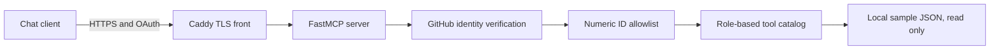

# Read-only MCP gateway

A small, self-hosted FastMCP server that gives a chat client a deliberately
limited set of read-only tools. GitHub OAuth establishes identity, a numeric
GitHub-ID allowlist decides who may enter, and role-based catalogs decide which
tools each approved user can see and call.

It exists to make the safe surface explicit: point a compatible chat client at
one HTTPS endpoint without exposing a shell, a database, write operations, or
the rest of a private network.

The allowlist fails closed. Startup stops if the operator list is missing,
contains placeholders, contains nonnumeric values, or assigns one ID to two
roles. A valid GitHub account is not enough: an ID absent from the allowlist is
rejected before any tool is available. Tool permissions are checked both when
the catalog is listed and again when a tool is called.

This public copy ships three example tools backed only by
[`app/sample_data.json`](app/sample_data.json): list sample services, inspect
one sample service, and search sample runbooks. They demonstrate the gateway
end to end without a private backend.

## Run locally

Install Docker with the Compose plugin, create a GitHub OAuth App whose callback
URL is `https://gateway.example.com/auth/callback`, point a test DNS name at the
machine, then run these three commands:

```bash
cp config.example.env config.env
${EDITOR:-vi} config.env
docker compose --env-file config.env up --build
```

Replace every `YOUR_...` value before the third command. Caddy obtains and
renews the HTTPS certificate and receives only the domain name; the OAuth secret
and the signing key reach the application container alone. The MCP endpoint is
`https://gateway.example.com/mcp` after the example domain is replaced.

## Test offline

The test suite uses no network calls. Create the environment and install its
pinned dependencies once, then run it:

```bash
python3 -m venv .venv
.venv/bin/pip install -r app/requirements.txt
.venv/bin/python -m pytest -q
```

## Architecture



Caddy is the only published service. The application container has no published
port, runs without Linux capabilities, uses a read-only root filesystem, and
receives no host sockets or private data mounts. OAuth registrations and the
generated signing key persist in a dedicated volume.

What it is not: a general-purpose remote administration service or a proxy to
arbitrary files, commands, URLs, or databases.
