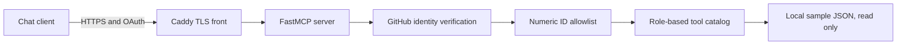

# Read-only MCP gateway

A small, self-hosted FastMCP server that gives a chat client a deliberately
limited set of read-only tools. GitHub OAuth establishes identity, a numeric
GitHub-ID allowlist decides who may enter, and role-based catalogs decide which
tools each approved user can see and call.

It exists to make the safe surface explicit: point a compatible chat client at
one HTTPS endpoint without exposing a shell, a database, write operations, or
the rest of a private network.

The allowlist fails closed. Startup stops if the operator list is missing,
contains placeholders, contains nonnumeric values, or assigns one ID to two
roles. A valid GitHub account is not enough: an ID absent from the allowlist is
rejected before any tool is available. Tool permissions are checked both when
the catalog is listed and again when a tool is called.

This public copy ships three example tools backed only by
[`app/sample_data.json`](app/sample_data.json): list sample services, inspect
one sample service, and search sample runbooks. They demonstrate the gateway
end to end without a private backend.

## Run locally

Install Docker with the Compose plugin, create a GitHub OAuth App whose callback
URL is `https://gateway.example.com/auth/callback`, point a test DNS name at the
machine, then run these three commands:

```bash
cp config.example.env config.env
${EDITOR:-vi} config.env
docker compose --env-file config.env up --build
```

Replace every `YOUR_...` value before the third command. Caddy obtains and
renews the HTTPS certificate and receives only the domain name; the OAuth secret
and the signing key reach the application container alone. The MCP endpoint is
`https://gateway.example.com/mcp` after the example domain is replaced.

## Test offline

The test suite uses no network calls. Create the environment and install its
pinned dependencies once, then run it:

```bash
python3 -m venv .venv
.venv/bin/pip install -r app/requirements.txt
.venv/bin/python -m pytest -q
```

## Architecture



Caddy is the only published service. The application container has no published
port, runs without Linux capabilities, uses a read-only root filesystem, and
receives no host sockets or private data mounts. OAuth registrations and the
generated signing key persist in a dedicated volume.

What it is not: a general-purpose remote administration service or a proxy to
arbitrary files, commands, URLs, or databases.

## About this copy

This is a public copy, published on 2026-09-03, of a self-hosted gateway the
author runs behind GitHub OAuth and TLS. The private deployment fronts private
tools and data; this copy replaces them with sample data so the gateway,
allowlist, and role catalogs can be exercised end to end. The public copy
carries its own offline test suite.

## Cloud deployment (AWS, single node)

This repository includes a reproducible, single-node AWS deployment for a personal demonstration. The architecture runs the FastMCP server alongside Caddy on an Amazon Linux 2023 EC2 host, backed by an encrypted EBS volume for persistent state, AWS Systems Manager (SSM) Parameter Store for runtime secrets, and automated GitHub Actions deployments via OpenID Connect (OIDC) and SSM Run Command. The host has no open SSH port and no load balancer; at 2026-09 us-east-2 prices the running demo costs about USD 0.70 per day.

### Reproduce locally in ten minutes

You can test and verify the entire gateway stack, container lifecycle, and release automation locally without an AWS account using Docker and Python:

```bash
python3 -m venv .venv
.venv/bin/pip install -r app/requirements.txt
.venv/bin/python -m pytest -q
scripts/evidence/local_checks.sh
bash tests/cloud/local_release_drill.sh
```

These commands validate offline unit tests, execute negative authorization mutation tests, build and smoke-test the production container, and exercise the end-to-end release state machine (including digest verification, health-gated cutovers, simulated readiness failures, and automatic rollbacks) against a local Docker registry.

### Deploy to AWS

The cloud documents:

- [docs/cloud/RUNBOOK.md](docs/cloud/RUNBOOK.md): Complete operator procedures covering account bootstrap, secret storage, Terraform provisioning, digest-based releases, verification, deliberate failure drills, and clean teardown.
- [docs/cloud/ARCHITECTURE.md](docs/cloud/ARCHITECTURE.md): Component topology diagram, trust boundaries, credential flow matrices, and operational trade-offs.
- [docs/cloud/EVIDENCE.md](docs/cloud/EVIDENCE.md): Machine-generated acceptance test matrix recording unit, container, and release drill verification checks.
- [docs/cloud/TECHNICAL_DEFENSE.md](docs/cloud/TECHNICAL_DEFENSE.md): Detailed architectural defense of deployment decisions, security controls, and design rationale.
- [docs/cloud/CONTRACTS.md](docs/cloud/CONTRACTS.md): Frozen interface contracts defining configuration parameters, health endpoints, release manifests, and directory layouts.

### What is and is not claimed

What is claimed: a reproducible, deny-by-default single-node cloud deployment with immutable container releases pinned by digest, automated rollback on failed health checks, in-process telemetry secret scrubbing, and zero static AWS credentials in CI/CD. What is not claimed: Zero-downtime cutover (upgrades incur a brief, measured service interruption during container swaps), automated multi-node failover, or a persistent custom domain when using derived sslip.io hostnames. The live cloud steps were executed once, on 2026-09-13, against a disposable AWS account and torn down the same day; the record is in docs/cloud/EVIDENCE.md and docs/cloud/EVIDENCE_WALKTHROUGH.md.
