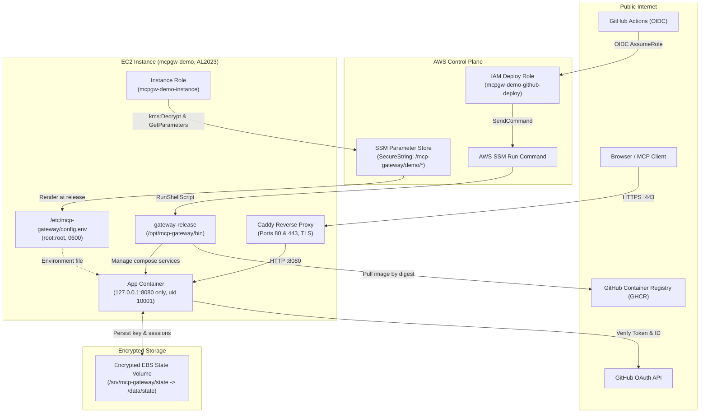

# Architecture and trust boundaries

This document defines the system topology, trust boundaries, and operational limitations of the single-node AWS deployment for the read-only Model Context Protocol (MCP) gateway.

## Trust Boundaries and Component Flow

The gateway separates public client ingress, administrative execution, and secret delivery into distinct unidirectional paths. Public clients connect exclusively to Caddy over TLS. Deployment and operational tasks enter via AWS Systems Manager (SSM) Run Command authenticated through GitHub Actions OpenID Connect (OIDC). Application credentials are read directly by the instance profile from AWS Systems Manager Parameter Store at release time.

## Boundary Access Control Matrix

The following matrix documents callers, reachable destinations, credentials, and explicitly prohibited capabilities across all system interfaces:

| Source | Destination | Credential | Explicitly Prohibited Capabilities |
|---|---|---|---|
| Browser / Client | Caddy reverse proxy | TLS handshake; OAuth bearer token | Cannot reach app container directly (app binds 127.0.0.1:8080 only, not published). No shell or administrative access. |
| GitHub Actions | EC2 host | GitHub OIDC token bound to repo:neal-systems@324300420/mcp-gateway@1355437034:environment:demo | No SSH (port 22 closed, no key pair). Cannot target untagged instances. Cannot read Parameter Store through the API. Honest caveat: AWS-RunShellScript runs as root on the instance, so whoever can trigger the demo environment can run any command there, including reading the rendered config file. The GitHub environment's required reviewer is the control on that. |
| Host Instance | SSM Parameter Store | Instance profile (mcpgw-demo-instance) | Decryption constrained via kms:ViaService to regional SSM endpoint. Cannot access arbitrary KMS keys or foreign SSM prefixes. |
| App Container | Host environment & AWS | Container user (uid 10001) | IMDSv1 disabled; IMDSv2 hop limit set to 1, blocking container from reaching instance credentials. Root filesystem is read-only with ALL capabilities dropped. |
| Deployment Pipeline | Local filesystem | Root ownership (0600) | No secrets stored in Terraform state, git repository, or GitHub Actions workflow run logs. |

## Limitations

The single-node architecture prioritizes simplicity, low cost, and reproducibility while acknowledging specific trade-offs:

- Single Node: All services run on one t3.small EC2 host without container orchestration. Physical host failure requires manual re-provisioning via Terraform to launch a replacement instance and re-attach the state volume.
- Short Interruption on Release: Upgrades execute a health-gated cutover where the old container stops before the replacement candidate starts. This creates a brief, measured service interruption: 3.1 to 3.5 s on the host's release log and 3.11 s measured from the internet during the live A-to-B upgrade; a failed candidate costs the 60 s readiness timeout plus the rollback (61 s measured). Zero downtime is not claimed.
- Teardown Discards State: The dedicated EBS state volume has no prevent_destroy lifecycle rule. Running terraform destroy removes the volume, discarding the generated JWT signing key and client OAuth registrations.
- No Automated Failover: There is no standby instance, secondary replica, or load balancer health-check rerouting.
- Ephemeral sslip.io Hostname: The derived sslip.io hostname depends on the allocated Elastic IP. Re-allocating the Elastic IP changes the domain, requiring updates to the OAuth callback URL.
- Public Ports 80 and 443: Ingress rules allow 0.0.0.0/0 to support Let's Encrypt HTTP-01 challenges and user browser redirects. Access control relies on Caddy reverse proxying and application allowlists rather than network segmentation.
